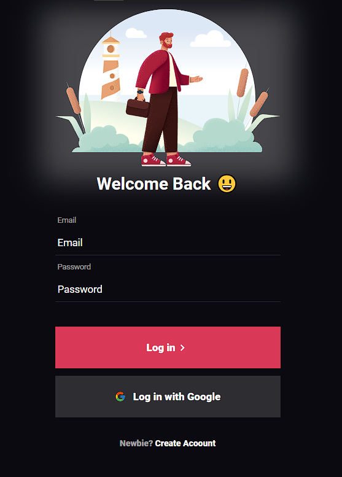

# Tela de Login

## Descrição
O Tela de Login é um projeto de uma página de login simples e responsiva. Este projeto foi desenvolvido como parte do meu aprendizado em desenvolvimento web.

## Funcionalidades Principais
- Formulário de login com campos de e-mail e senha.
- Validação básica dos campos de entrada.
- Design responsivo para se adaptar a diferentes tamanhos de tela.

## Tecnologias Utilizadas
- HTML5
- CSS3 (com pré-processador SASS/SCSS)
- JavaScript (para validação de formulário, se necessário)
- Bootstrap (opcional, dependendo da preferência e necessidade de um framework CSS)
- Git (para controle de versão)

## Como Utilizar
1. Clone o repositório (`git clone https://github.com/AngeloHervis/tela-de-login.git`).
2. Abra o arquivo `index.html` em seu navegador web.
3. Preencha os campos de e-mail e senha e clique no botão de login para acessar.

## Autor
Angelo Hervis
- GitHub: [AngeloHervis](https://github.com/AngeloHervis)
- LinkedIn: [Angelo Hervis](https://www.linkedin.com/in/angelohervis/)